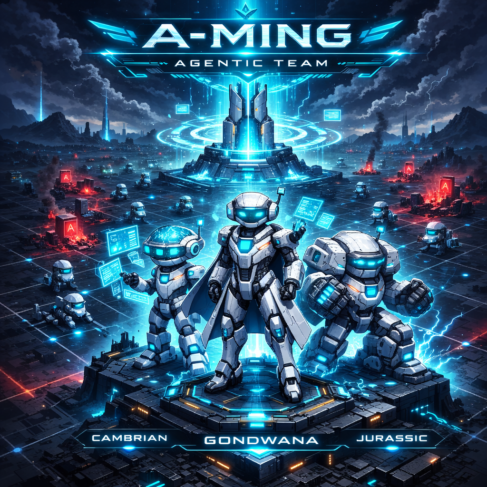
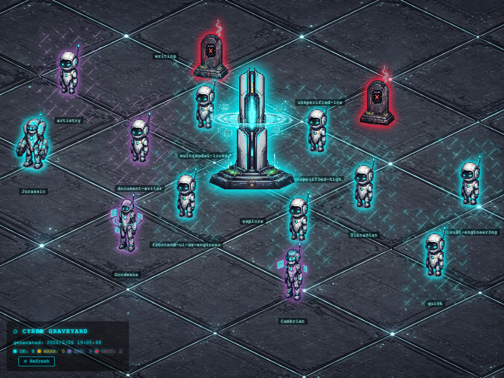

# Cyber Graveyard Dashboard

<p align="center">
  
</p>

Isometric pixel art monitoring dashboard for LLM subagent health

<p align="center">
  
</p>

## Overview

This isometric pixel art dashboard visualizes the health of LLM subagents as a cyber graveyard. Alive agents appear as unique robot sprites with an ice-blue glow. Dead agents appear as tombstones with a red glow. A central orchestration tower pulses at the grid center.

Three hero agents have unique sprite designs: Gondwana, Cambrian, and Jurassic. The project is built with a vanilla HTML, CSS, and JS frontend and a Python Flask backend. It uses no frameworks.

## Features

### Visualization
*   Isometric grid rendering with proper z-index sorting.
*   Viewport-responsive dual scaling system. It uses spriteScale for sprite and tower sizes, and spreadScale for grid spread.
*   Cross-browser pixel-perfect rendering for Safari and Chrome.
*   Unique robot sprites for hero agents including Gondwana, Cambrian, and Jurassic.
*   Status glow effects: ice-blue for OK, amber for WARN, purple for ERROR, and red for CRITICAL.
*   CSS animations such as the agent breathe effect and tower pulse using drop-shadow.

### Interaction and HUD
*   HUD with severity counts for OK, WARN, ERR, and CRIT in the bottom-left.
*   Interactive tooltips with a hover-bridge pattern.
*   Non-failing agents: the tooltip follows the cursor with the name, model, status, and latency.
*   Failing agents: the tooltip is anchored to the sprite with an Accept button for model replacement.
*   Model replacement flow: clicking Accept opens a confirmation dialog, sends a POST request to /api/replace-model, re-pings the agent, and auto-refreshes the dashboard.
*   Manual Refresh button (⟳ Refresh) triggers real HTTP probing via the opencode CLI.
*   Dynamic roster parsing from configuration with no hardcoded names.

## Architecture

*   The Flask backend in `backend/server.py` serves static files and the REST API.
*   The vanilla HTML, CSS, and JS frontend reads JSON data and calls the API.
*   Real HTTP probing uses an `opencode run` CLI subprocess with a 60-second timeout. It includes model deduplication and concurrent workers.
*   A simulation mode is available for development by running `python daily_ping.py --simulate`.

## Project Structure

```
Graveyard_Dashboard/
├── backend/
│   ├── daily_ping.py          # API probe script, real probing and simulation mode
│   └── server.py              # Flask API server, static serving and REST API
├── frontend/
│   ├── index.html             # HTML shell
│   ├── style.css              # Isometric layout, glow animations, and dialog styles
│   └── app.js                 # Rendering, tooltip hover-bridge, and replacement flow
├── data/
│   ├── graveyard_status.json  # Probe output generated by the backend
│   └── roster.template.json   # Roster config template
└── images/
    ├── Gondwana.png           # Hero agent sprite, Gondwana
    ├── Cambrian.png           # Hero agent sprite, Cambrian
    ├── Jurassic.png           # Hero agent sprite, Jurassic
    ├── agent.png              # Default alive agent sprite
    ├── tombstone.png          # Dead agent tombstone sprite
    ├── tower.png              # Central orchestration tower
    ├── background.png         # Isometric tech floor
    ├── cover.png              # README cover image
    └── demo.png               # Dashboard demo screenshot
```

## Quick Start

1.  Install dependencies: `cd backend && python3 -m venv venv && source venv/bin/activate && pip install flask pillow`
2.  Copy roster config: `cp data/roster.template.json data/roster.json`. Edit this file with your agent and model configuration.
3.  Start the server: `python3 backend/server.py`
4.  Open: `http://localhost:8080/frontend/index.html`
5.  Alternative for static only with no API features: `python3 -m http.server 8080` from the project root.

## API Endpoints

| Endpoint | Method | Description |
|:---|:---|:---|
| `/api/status` | GET | Returns the current graveyard_status.json |
| `/api/models` | GET | Returns models grouped by tier with alive status |
| `/api/suggest-replacement?model=X` | GET | Suggests a same-tier alive replacement model |
| `/api/replace-model` | POST | Swaps the model in the config, re-pings, and updates status |
| `/api/refresh` | POST | Re-probes all agents and returns fresh status data |

## Status Mapping

| HTTP Status | Agent Status | Severity |
| :--- | :--- | :--- |
| 200 | ALIVE | OK |
| 429 | RATE_LIMIT | WARN |
| 408 / Timeout | TIMEOUT | ERROR |
| 5xx | PROVIDER_ERROR | ERROR |
| 401 / 403 | UNAUTHORIZED | CRITICAL |
| 404 | MODEL_NOT_FOUND | CRITICAL |
| Other 4xx | BAD_REQUEST | ERROR |

## Model Tier System

The system classifies models into tiers: top (opus) > high (gpt-5, pro) > mid (sonnet) > light (flash, haiku). When a model fails, the replacement logic picks an alive model from the same tier. It falls back to one tier up if no same-tier models are available.

## License

MIT
